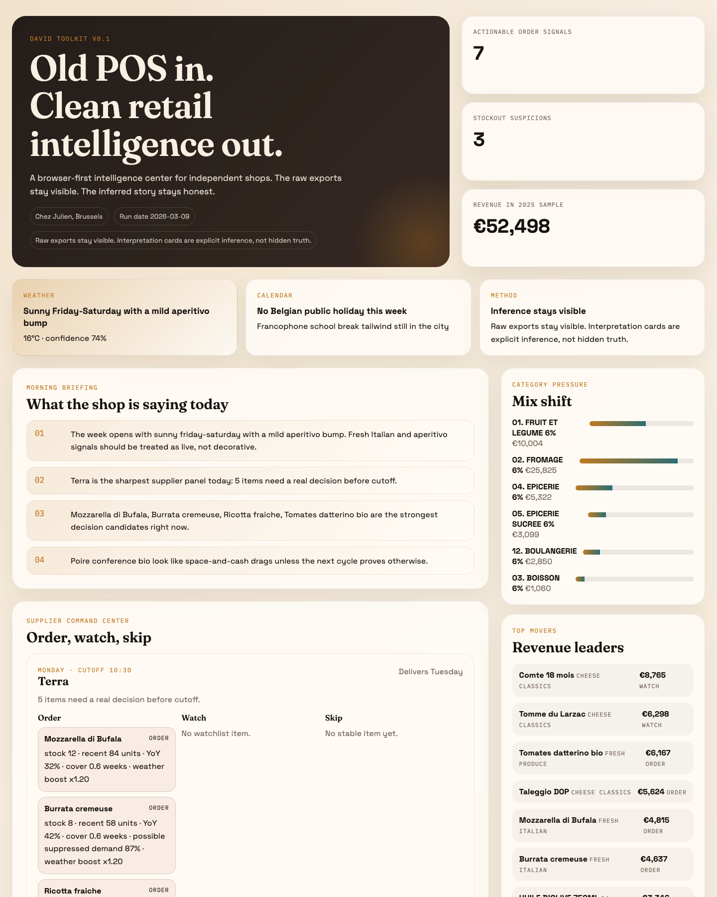

# David Toolkit

**A browser-first intelligence center for independent shop owners.**

David Toolkit starts where most small shops already are: an old POS, exported spreadsheets, supplier deadlines, and too much judgment trapped in one person's head. This repo turns that reality into a clean, open-source intelligence layer.

This first demo is built around a real independent food shop context. It reads retail exports, applies a curated correction layer, overlays weather and calendar context, and renders a founder-grade dashboard that separates raw evidence from interpreted signals.



## What Works Today

- Parses `ExportStatVente`, `STA_satvente`, `STA_ratioCAT`, and `Analyse_00` style exports
- Builds a browser-ready intelligence center with:
  - supplier command panels
  - product and category intelligence
  - raw vs interpreted demand signals
  - weather and holiday overlays
  - 3-year macro context when a finance workbook is present
- Ships with a sanitized sample dataset so outsiders can run the demo without private shop data
- Includes a verification script that checks parser and scoring assumptions

## Quick Start

```bash
npm install
npm run prepare:sample
npm run build:data
npm run serve
```

Open `http://localhost:4173`.

You can also just run:

```bash
npm install
npm run dev
```

## Using Your Own Data

The demo ships with sanitized files in [`sample-data/raw`](sample-data/raw). Replace them with your own exports that follow the same shapes:

- `export-stat-vente-2024.csv`
- `export-stat-vente-2025.csv`
- `sta-satvente-2025.csv`
- `sta-ratioCAT-2025.csv`
- `analyse-2025.csv`
- `chez-julien-finance-demo.xlsx` or another workbook with the same sheet names

Then run:

```bash
npm run build:data
```

## Repository Guide

- [`ARCHITECTURE.md`](ARCHITECTURE.md) explains the importer, scoring model, and front-end structure.
- [`DATA_SOURCES.md`](DATA_SOURCES.md) documents every expected file and mapping layer.
- [`DEMO.md`](DEMO.md) gives a demo script for talks, videos, and a `Show HN` style launch.
- [`ROADMAP.md`](ROADMAP.md) shows what comes next.
- [`docs/ISSUE_BACKLOG.md`](docs/ISSUE_BACKLOG.md) seeds the first public issue backlog.

## Contribution Standard

This repo is meant to be contributor-ready from day one.

- Read [`CONTRIBUTING.md`](CONTRIBUTING.md) before opening a pull request.
- Respect the [`CODE_OF_CONDUCT.md`](CODE_OF_CONDUCT.md).
- Report security issues through [`SECURITY.md`](SECURITY.md).

## Why AGPL

The point of David Toolkit is not just “source visible.” It is a real commons project. If someone runs an improved hosted version, those improvements should stay in the commons. That is why the code is licensed under `AGPL-3.0-only`.

## Status

`v0.1` is a serious demo, not a production system.

- It is strong enough to show the concept clearly.
- It is not yet a live ordering engine.
- All “AI-corrected” interpretations remain visible as **inference** with confidence tags, never hidden truth.
